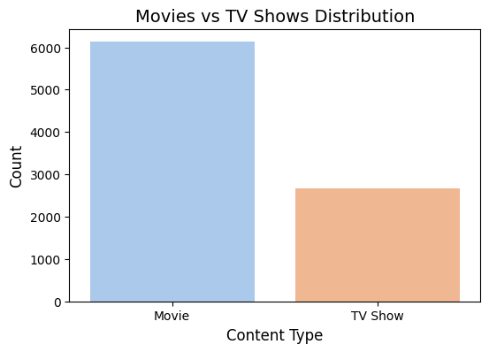
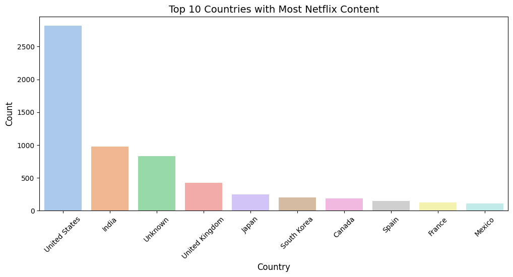
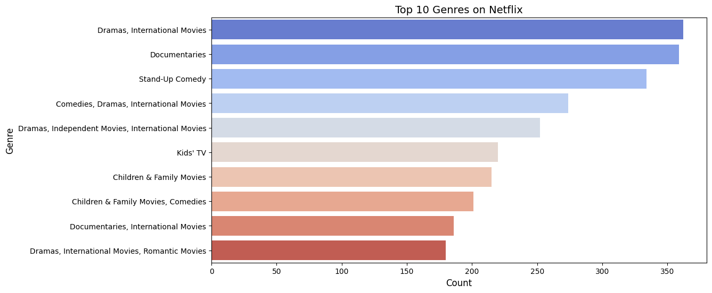
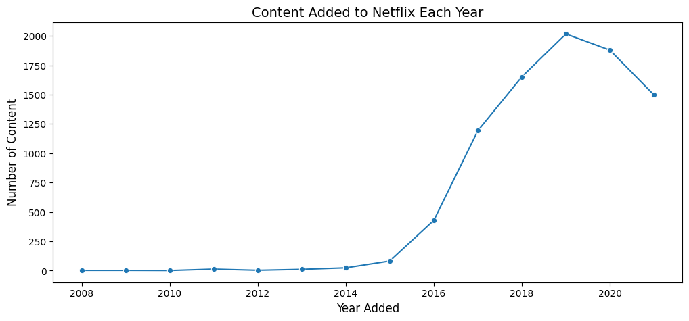

# Netflix-Data-Analysis
Netflix Data Analysis | Python • Pandas • Matplotlib • Seaborn

## 📌 Project Overview
This project performs Exploratory Data Analysis (EDA) on Netflix Movies and TV Shows using Python. The analysis explores content types, ratings, genres, countries, release trends, duration, audience preferences, and content growth over time.

## 🛠️ Tools & Technologies
- Python
- Pandas
- Matplotlib
- Seaborn
- Jupyter Notebook

## 🔍 Analysis Performed
- Data Exploration
- Data Cleaning
- Descriptive Statistics
- Data Visualization
- Time Series Analysis
- Content Analysis
- Genre Analysis
- Geographical Analysis
- Correlation Analysis
- Audience Engagement Analysis
- Language Analysis
- Content Evolution Over Time

## 📊 Visualizations

### Movies vs TV Shows Distribution

### Top 10 Countries with Most Netflix Content

### Top 10 Genres on Netflix

### Content Added to Netflix Over the Years

## 📊 Key Findings
- Movies are more dominant than TV Shows on Netflix.
- Drama, International Movies, and Comedy are among the most common genres.
- TV-MA and TV-14 are the most common ratings.
- Netflix content increased rapidly after 2015, especially during 2018–2020.
- The United States is the largest contributor of Netflix content, followed by India and the United Kingdom.
- Most movies have medium-length durations.
- Many TV Shows contain only one season.
- Netflix has a diverse content library across countries, genres, and audience categories.

## 🎯 Conclusion
The analysis shows that Netflix has a highly diverse and globally distributed content library. Movies, mature-rated content, and popular genres such as Drama and International Movies form a major part of the platform's content.

## 📁 Project File
`Netflix_EDA_Project.ipynb`

## 👩‍💻 Skills Demonstrated
Python | Pandas | Data Cleaning | Exploratory Data Analysis | Data Visualization | Matplotlib | Seaborn | Statistical Analysis
